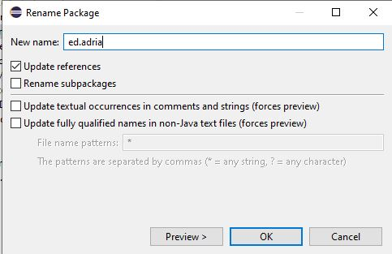
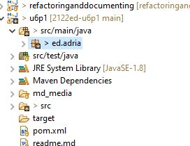
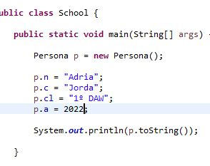
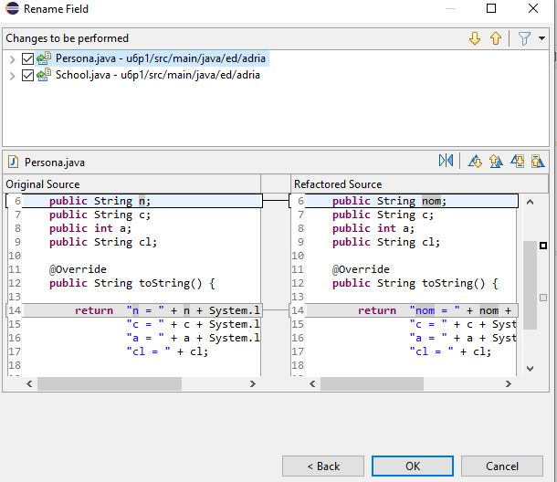

# UD6 - Pràctica 1 - Refactoritzem

* [1. Realitza els següents canvis al codi](#1-realitza-els-següents-canvis-al-codi)
* [2. **Refactoritza** el codi font de la següent forma: ( Fes les captures de totes les finestres que ixen)](#2-refactoritza-el-codi-font-de-la-següent-forma--fes-les-captures-de-totes-les-finestres-que-ixen)
* [3. En el mètode `main()`, **refactoritza**](#3-en-el-mètode-main-refactoritza)
* [4. Executa el programa i fes una captura en consola](#4-executa-el-programa-i-fes-una-captura-en-consola)
* [5. Fes una captura del codi font resultant després de refactoritzar](#5-fes-una-captura-del-codi-font-resultant-després-de-refactoritzar)

Realitza un *fork* del projecte que es troba a: <https://github.com/arturocandela/2122ed-u6p1>. Una vegada realitzat, crea una nova branca que s'anomene **teunomcognom**  i comprova que pots executar-lo a **eclipse**. Una vegada ho tingues, realitza les tasques següents.

> Cada tasca ha d'estar com a mínim en un commit diferent i la branca **teunomcognom** ha de pujar-se al teu repositori nou creat.
> La entrega es farà adjuntant l'enllaç al repostori a l'activitat i adjuntant el pdf amb les captures demandes / text a l'activitat.

## 1. Realitza els següents canvis al codi

* Reanomena el paquet `ed.arturo` a `ed.<elteunom>`
* Reanomena les cadenes que es troben definides al mètode `main` de la classe `School`.

> Para realizar la actividad hay que usar el refacor de Eclipse, para ello usando click derecho sobre el paquete ed.arturo y seleccionamos "Refactor" y a continuacion "rename", a continuacion cambiamos el nombre de ed.arturo a ed.adria ( en mi caso). Para la siguient parte unicamente se accede a las strings situados ne el metodo main de la clase School.java y se cambian a mis datos como se puede ver en las imagenes anexas.

-El primer push se ha realizado en la rama main, por lo que el primer ejercicio estara tambien en la rama main.

## 2. **Refactoritza** el codi font de la següent forma: ( Fes les captures de totes les finestres que ixen)

Canvia el nom dels atributs de la classe `Persona`. 

> **Nota:** polsa en `options` perquè es canvie també el nom en les cadenes lierals on apareixen eixes variables:

* n -> nom
* c -> cognoms
* a -> any
* cl -> cicle formatiu

Canvia el nom de les classes:

* School -> Intitut
* Persona -> Alumne

>Para poder realizar el cambio unicamente hacemos click derecho sobre la variable que deseamos cambiar y seleccionamos "Refactor" y "Rename" a el nuevo nombre que deseamos cambiar, tambien se nos da la opcion de poder cambiar la variable en los Strings. El procedimiento para cambiar el nombre de las clases es identico.
]
![Refactor Image Final(md_media/2.3.JPG)]

## 3. En el mètode `main()`, **refactoritza**

Extrau les cadenes i números a constants de classe amb els següents noms: (Fes **captures** de totes les finestres que ixen)

"Arturo" -> `NOM_ALUMNE`
"Candela" -> `COGNOMS_ALUMNE`
"1º DAM/DAW" -> `CICLE_FORMATIU`
2019 -> `ANY`

>Para poder extraer constantes utilizamos "Refactor" y de ahi usamos la opcion "Extract Constant", a partir de ahi se cambia el nombre y el programa te permite cambiar si la constante es publica, provada... En este caso se ha elegido "private" 
![Refactor Image Constant(md_media/3.JPG)]
![Refactor Image Final(md_media/3.1.JPG)]

## 4. Executa el programa i fes una captura en consola

( D'aquest apartat no es necessari fer un commit a menys que faltara algo del commit anterior)

## 5. Fes una captura del codi font resultant després de refactoritzar

( D'aquest apartat no es necessari fer un commit a menys que faltara algo del commit anterior)
